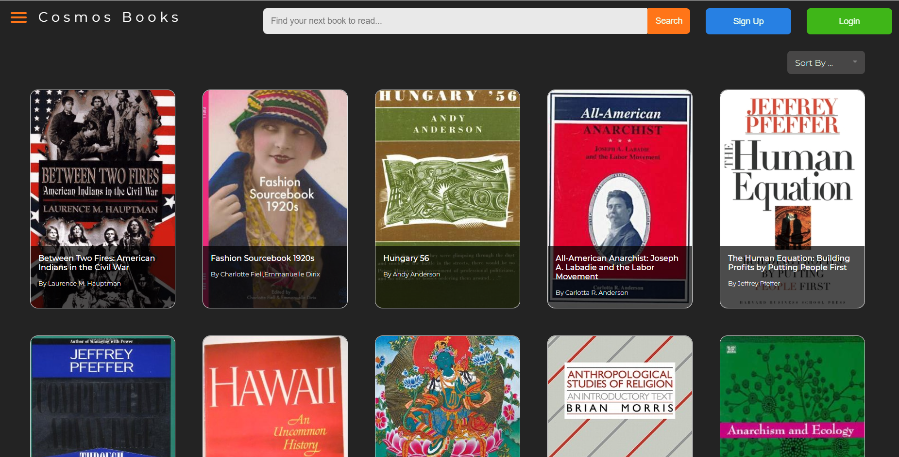

# Cosmos Bookstore

Cosmos Bookstore is a sample books catalog application that demonstrates the capabilities of Azure Cosmos DB API for MongoDB.

Some of the functionalities being demonstrated are:

- Connecting to the database & the client configuration
- Reads & Queries
- Sorting & Indexing
- Updates
- Using different operators
- Checking RU cost of the previous operation
- Regex queries
- Aggregation pipelines
- Azure Search integration

## Deploy the app quickly

Clone this repository and navigate to the root of the directory.

Follow the steps below to deploy the app with minimal effort and begin experimenting with the application and the codebase.

### Deploy the resources to Azure

The template below deploys the application into an Azure App Service instance and creates an Azure Cosmos DB account.
Simply enter the Resource Group name in this template to deploy the resources.

### Connect to the application

Now you can try out the application by browsing to the app service URL.
You can find the URL in the overview section of the App Service resource created by the deployment template.

### Setup Azure Search Integration

Optionally, you can [setup Azure Search integration](deployment/docs/azuresearchsetup.md) to try out the full text functionality in the app. 
> Azure Search support for Cosmos DB API for MongoDB is currently in preview, so the feature will explicitly need to be enabled for your subscription.

## Dataset Credits

The dataset used in this application is ["GoodReads 100k books"](https://www.kaggle.com/mdhamani/goodreads-books-100k) dataset from Kaggle.
